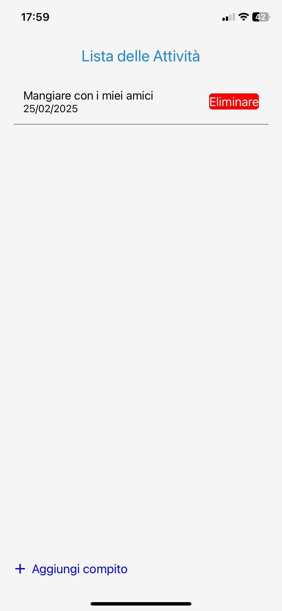

# Applicazione Lista delle Attività in React Native

## Descrizione del Progetto
Questa applicazione Lista delle Attività è stata sviluppata utilizzando React Native ed Expo. Permette agli utenti di gestire le loro attività quotidiane in modo efficiente, offrendo funzionalità per aggiungere, visualizzare ed eliminare le attività.

## Caratteristiche Principali

### Visualizzazione delle Attività:
- Mostra una lista di attività utilizzando FlatList di React Native
- Ogni attività presenta un titolo e una data

### Aggiunta di Nuove Attività:
- Gli utenti possono aggiungere nuove attività tramite un pulsante flottante
- Premendo il pulsante, si apre un modal per inserire il titolo e la data della nuova attività

### Eliminazione delle Attività:
- Ogni attività nella lista ha un pulsante di eliminazione
- Premendo il pulsante, viene mostrata una conferma prima di eliminare l'attività

### Persistenza dei Dati:
- Le attività vengono salvate utilizzando AsyncStorage, permettendo che persistano anche dopo la chiusura dell'applicazione

## Tecnologie Utilizzate
- React Native
- Expo
- @rneui/themed (React Native Elements)
- AsyncStorage

## Conformità ai Requisiti
L'applicazione soddisfa tutti i punti specificati nei requisiti originali:

### Visualizzazione della lista delle attività:
- Implementata utilizzando FlatList di React Native
- Ogni attività mostra un titolo e una data

### Aggiunta di nuove attività:
- Aggiunto un pulsante flottante che apre un modal per inserire nuove attività
- Il modal permette di inserire sia il titolo che la data dell'attività

### Eliminazione di un'attività:
- Ogni attività ha un pulsante di eliminazione
- Implementata una conferma prima di eliminare l'attività

### Visualizzazione della lista:
- Utilizzato FlatList per mostrare le attività in modo efficiente

### Salvataggio dei dati:
- Implementato AsyncStorage per salvare la lista delle attività in modo persistente
- Le attività rimangono visibili anche dopo aver chiuso e riaperto l'applicazione

## Struttura del Progetto
Il progetto consiste in due componenti principali:
- App.js: Componente principale che gestisce la logica dell'applicazione e la visualizzazione della lista delle attività
- AddTaskModal.js: Componente modal per aggiungere nuove attività

## Come Eseguire il Progetto
1. Installa Expo CLI globalmente: `npm install -g expo-cli`
2. Clona questo repository
3. Naviga nella directory del progetto ed esegui `npm install` per installare le dipendenze
4. Esegui `expo start` per avviare l'applicazione
5. Usa l'applicazione Expo Go sul tuo dispositivo mobile per scansionare il codice QR e visualizzare l'applicazione

Questo progetto è stato sviluppato come parte di un esercizio di programmazione e dimostra la capacità di creare un'applicazione funzionale ed efficiente utilizzando React Native.

Home page

Possibilità di aggiungere una nuova attività

Possibilità di aggiungere una nuova attività

home page con i compiti

piu compiti

